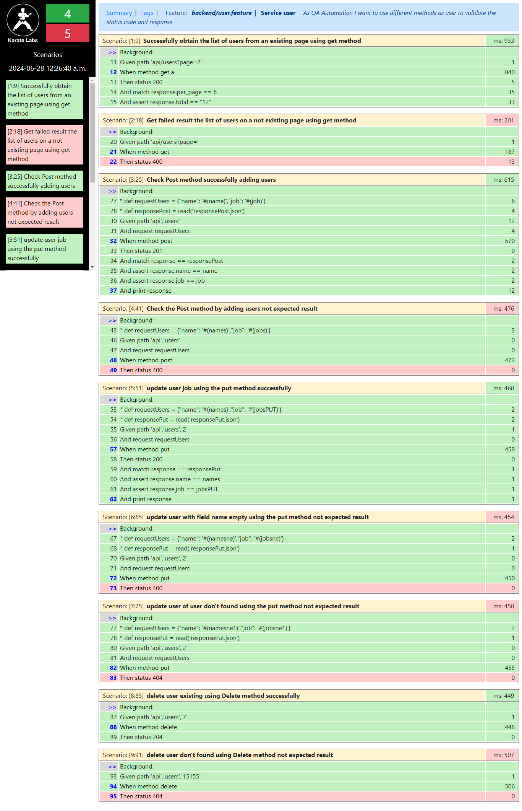

# Service Automation Project with Postman, Maven and Karate   🖥️🖥️🖥️

## Description

This project aims to automate service testing using Postman, Maven dependencies and the Karate framework. Karate allows API testing in a simple way, and with the combination of Postman and Maven, we can ensure high quality testing and consumption of services in an efficient way. The Screenplay framework using gherkin language will also be used.

In this project the most common examples of testing with the Karate framework are applied.
To apply the test cases we will use the test website https://reqres.in/, which provides several endpoints on which you can make GET, PUT, POST and DELETE requests.

## Project Structure 🦉🦉

├── pom.xml
├── README.md
├── src
│ └── test
│   └── java
│      └── backend
│        └── managementest
│        └── user
│   ├── resources
│ │ └  ── backend
│        └── responsePost.json
         └── responsePut.json
         └── user.feature
│      └── karate-config.js
       └── karate-properties.json

## Prerequisites

Before you start, make sure you have the following programs installed:

- [Java JDK 21](https://www.oracle.com/java/technologies/javase-downloads.html)
- [Apache Maven](https://maven.apache.org/install.html)
- [Postman](https://www.postman.com/downloads/)

## Installation

1️⃣ Clone the repository on your local machine:💾

    ```sh
    git clone https://github.com/amileja/backend_karate.git
    ```

2️⃣ Configure the project in your IDE of choice (e.g., the one used for the creation of this project was  IntelliJ IDEA,you can also use Eclipse), select  **File > Open...**. Navigate to the project directory and select it.

3️⃣ IntelliJ IDEA will automatically detect that it is a Maven project and start downloading the necessary dependencies..


## Evidences report 
The following is the evidence of the successful generation of the report in the execution of the automation. 



## Karate Configuration

Karate is a framework of the API testing software that combines a simple syntax with powerful testing capabilities. The basic configuration is done in the `pom.xml`.


### Dependencies ⚠️

Make sure your `pom.xml` include the following units:

```xml
<?xml version="1.0" encoding="UTF-8"?>
<project xmlns="http://maven.apache.org/POM/4.0.0"
         xmlns:xsi="http://www.w3.org/2001/XMLSchema-instance"
         xsi:schemaLocation="http://maven.apache.org/POM/4.0.0 http://maven.apache.org/xsd/maven-4.0.0.xsd">
    <modelVersion>4.0.0</modelVersion>

    <groupId>org.example</groupId>
    <artifactId>petStore</artifactId>
    <version>2.0-SNAPSHOT</version>
    <packaging>jar</packaging>

    <properties>

        <maven.compiler.version>3.8.1</maven.compiler.version>
        <project.build.sourceEncoding>UTF-8</project.build.sourceEncoding>
        <java.version>21.0.2</java.version>
        <karate.version>1.1.0</karate.version>
    </properties>

    <dependencies>

        <dependency>
            <groupId>io.cucumber</groupId>
            <artifactId>cucumber-java</artifactId>
            <version>7.2.3</version>
            <scope>test</scope>
        </dependency>
        <dependency>
            <groupId>io.cucumber</groupId>
            <artifactId>cucumber-junit</artifactId>
            <version>7.2.3</version>
            <scope>test</scope>
        </dependency>
        <!-- JUnit -->
        <dependency>
            <groupId>junit</groupId>
            <artifactId>junit</artifactId>
            <version>4.13.2</version>
            <scope>test</scope>
        </dependency>
        <dependency>
            <groupId>io.karatelabs</groupId>
            <artifactId>karate-junit5</artifactId>
            <version>1.5.0.RC4</version>
        </dependency>
        <dependency>
            <groupId>net.masterthought</groupId>
            <artifactId>cucumber-reporting</artifactId>
            <version>5.8.0</version>
        </dependency><dependency>
        <groupId>net.masterthought</groupId>
        <artifactId>cucumber-reporting</artifactId>
        <version>5.8.0</version>
    </dependency>
        <dependency>
            <groupId>io.cucumber</groupId>
            <artifactId>cucumber-java</artifactId>
            <version>6.9.1</version>
            <scope>test</scope>
        </dependency>
        <dependency>
            <groupId>io.cucumber</groupId>
            <artifactId>cucumber-junit</artifactId>
            <version>6.9.1</version>
            <scope>test</scope>
        </dependency>

    </dependencies>

    <build>
        <testResources>
            <testResource>
                <directory>src/test/resources</directory>
                <excludes>
                    <exclude>**/*.java</exclude>
                </excludes>
            </testResource>
        </testResources>
        <plugins>
            <plugin>
                <groupId>org.apache.maven.plugins</groupId>
                <artifactId>maven-compiler-plugin</artifactId>
                <version>${maven.compiler.version}</version>
                <configuration>
                    <encoding>UTF-8</encoding>
                    <source>${java.version}</source>
                    <target>${java.version}</target>
                </configuration>
            </plugin>
            <plugin>
                <groupId>org.apache.maven.plugins</groupId>
                <artifactId>maven-compiler-plugin</artifactId>
                <version>${maven.compiler.version}</version>

            </plugin>
        </plugins>
    </build>
</project>


